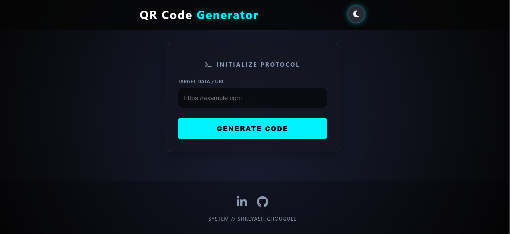
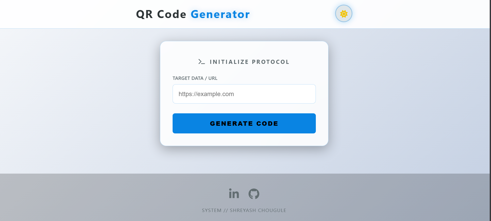

# 🌌 QR NEXUS | Futuristic QR Generator

> **A Next-Gen, Client-Side QR Code Generator featuring a Cyberpunk UI, Dark/Light Mode, and instant performance.**

**QR NEXUS** is a lightweight, high-performance web application that converts URLs and text into downloadable QR codes instantly. Built with a focus on modern UI/UX, accessibility, and SEO.

---

## 🚀 Live Demo

**[👉 View Live Demo on Netlify](https://QRCodeGenV.netlify.app)**
*(Replace this link with your actual Netlify URL after deployment)*

---

## ✨ Key Features

* **🎨 Cyber-Switch Theme System:** Smooth, animated toggle between **Void Dark** (Cyberpunk) and **Solar Light** (Sci-Fi) modes.
* **⚡ Instant Generation:** Uses client-side JavaScript (`qrcode.js`) to generate codes instantly—no server latency.
* **📱 Fully Responsive:** "Glassmorphism" card design that adapts perfectly to mobile, tablet, and desktop.
* **🔍 SEO Optimized:** Pre-configured metadata, JSON-LD Schema, and semantic HTML for high search engine ranking.
* **🎬 Cinematics:** smooth entry animations, scanning effects, and interactive hover states.
* **🛠 No Backend Required:** Runs entirely in the browser.

---

## 🛠️ Tech Stack

* **Core:** HTML5, CSS3 (CSS Variables, Flexbox, Animations), JavaScript (ES6+).
* **Libraries:** [QRCode.js](https://github.com/davidshimjs/qrcodejs) (via CDN).
* **Icons:** FontAwesome 6 (via CDN).
* **Deployment:** Netlify / Vercel / GitHub Pages.

---

## 📸 Screenshots

| **Dark Mode (Void)** | **Light Mode (Solar)** |
|:---:|:---:|
|  |  |

---

## 💻 Installation & Usage

This is a **static web application**, so no complex installation is required.

### Method 1: Instant Run
1.  Download the repository.
2.  Navigate to the `public` folder.
3.  Double-click `index.html` to open it in your browser.

### Method 2: VS Code Live Server (Recommended)
1.  Open the project folder in **VS Code**.
2.  Install the **Live Server** extension.
3.  Right-click `index.html` and select **"Open with Live Server"**.

## 👤 Author

**Shreyash Chougule**
